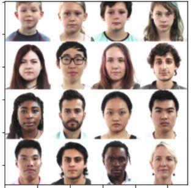
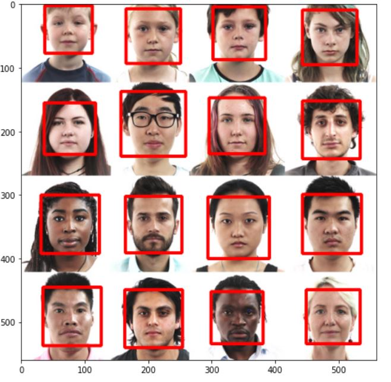
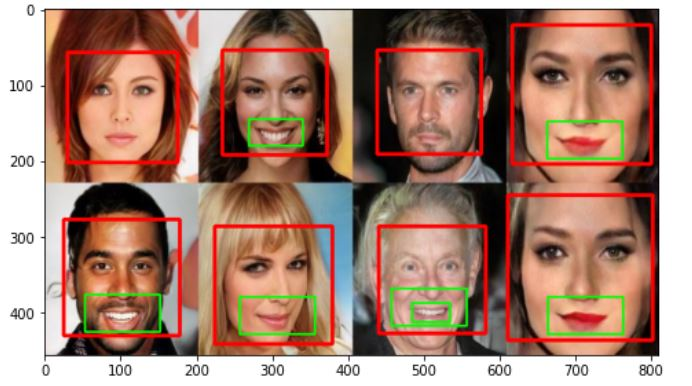

# Face-Detection using cv2
### In this project I have used cv2 and haarcascades to detect the face, eyes, smile on the images.

* Normal image

* Detection of face on the image

* Detection of eyes

* Detection of person smiling

